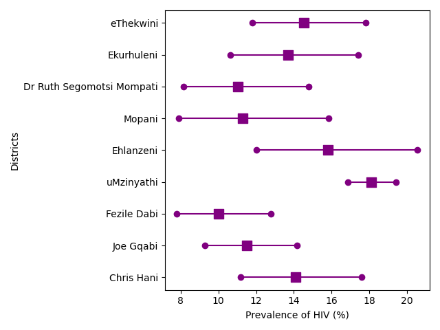
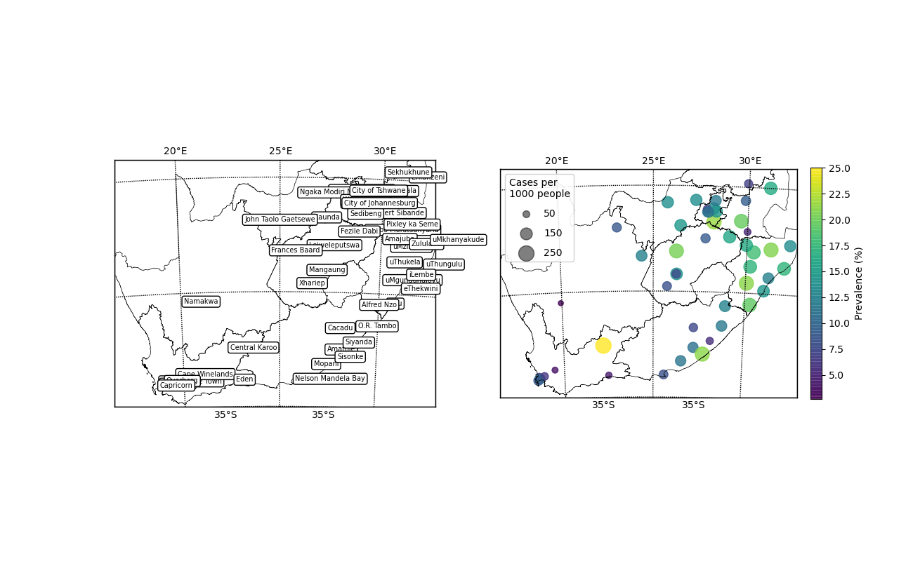

# HIV-South-Africa

Palindrome Data - Interview test submission

Exploratory data analysis of HIV cases in South African districts.
***

Figure 1: Average prevalence of HIV (%) in South African districts ending in 'i'.
***

Figure 2: Geographical map of South Africa with district names (left) and illustrating the number of HIV cases per 1000 people and prevalence of HIV (%) in South African districts (right).
